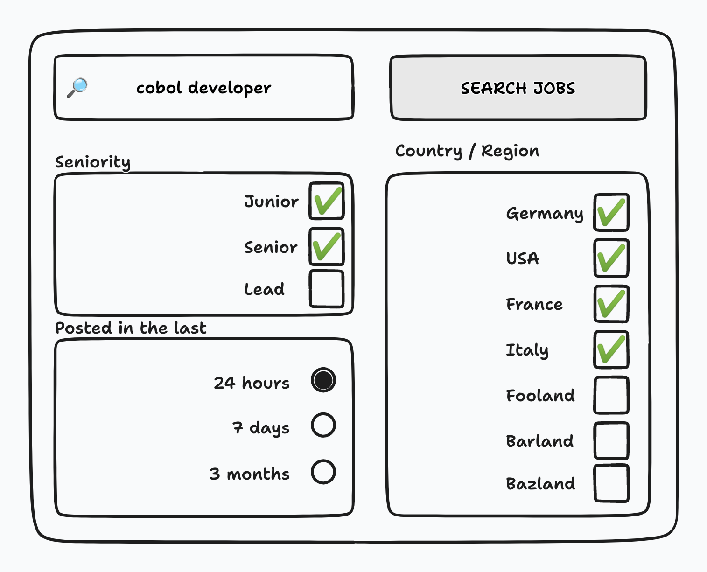

# Filtering data sets - `filter`

Data tends to grow over time, and as such, it is important to be able to filter the data sets that are returned by the API.
This allows for effective usage of resources, since it will only return the data set that is required.

On the implementation side, this will allow for a more efficient use of the databases, since it will only query the data
needed, avoiding extraneous fetching anti-pattern[^1].

For many APIs it will be critical to come up with an effective filtering strategy.

:::note
Filtering data is a complex topic, in pretty much any technology dealing with data. Be it SQL, NoSQL, ElasticSearch, or
any other technology. SQL, for example, provides a rich set of operators, such as `AND`, `OR`, `LIKE`, `IN`, `BETWEEN`, `IS NULL`, `IS NOT NULL`, `>`, etc.
:::

### Job Portal Case study

Suppose we want to build a **Job portal**, similar to the one on the image below:



Logically, we would like to query for such jobs that are:

* Posted by companies based in any of the following countries: `Germany`, `USA`, `France`, `Italy`
* **AND** are posted in the last 24 hours
* **AND** have seniority level of `Junior` or `Senior`
* **AND** match the search term of whatever the user has entered, let's say `cobol developer`

To be able to do this, we can come up with the following:

* `q` - a param to pass the search term to the API
* `filter` - a param to pass the filter criteria to the API

This is how the API call would look like:

```bash title="Using q and filter query parameters"
curl https://api.acme.com/jobs?
    q=cobol+developer&\
    filter=country in ("DE", "US", "FR", "IT")\
    AND\
    created_at gt "2021-01-01T00:00:00Z"\
    AND\
    seniority in ("JUNIOR", "SENIOR")'
```

In case that you want to add additional feature, such as inverting search, so that we want all the countries except the selected ones,
then we can add a `not` operator, and an API call would look like:

```bash title="Filtering with not operator"
curl https://api.acme.com/jobs?
    q=cobol+developer&\
    filter=not(country in ("DE", "US", "FR", "IT"))\
    AND\
    created_at gt "2021-01-01T00:00:00Z"\
    AND\
    seniority in ("JUNIOR", "SENIOR")'
```

### OData

If the level of flexibility above is not enough, you can think of using [OData](https://www.odata.org/).

[^1]: https://learn.microsoft.com/en-us/azure/architecture/antipatterns/extraneous-fetching/