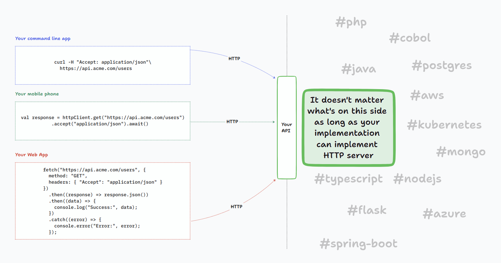

# Web APIs Fundamentals

## Platform independence

REST APIs are designed to work across different platforms because they use standard protocols like `HTTP`. Having only `HTTP` as a requirement means that there's:

* no need to use any particular cloud
* no need to use any particular programming language
* no need to install and/or configure any particular libraries and frameworks on any of the sides (client or server)

:::tip
Read [here](/docs/guidelines/advanced/rest-alternatives) for more information on how REST stacks up against other HTTP APIs
:::

As it can be seen on the image below, the only requirement that REST imposes is reliance on HTTP.



This brings the following benefits:

* Evolution of server-side independent of API clients:

  The only thing that matters to the API client is the API contract. As long as the API contract is in place, the implementors of
  the server-side can undergo any kind of change, no matter how major it is: migrating to another cloud, changing Database, programming
  language, etc.
* Rich ecosystem of clients

  Initial version being developed at the beginning of 90s, HTTP has been there long enough to be supported by a wide range of tools,
  programming languages, libraries, etc. This means that there's a low barrier to start writing clients for your APIs.

* Performance

  HTTP leverages caching, compression, and other techniques to improve performance. This reduces the strain on the backend side, reduces the bandwidth usage,
  allows for retries in case of unstable network (relying on HTTP methods idempotency), etc.

## Statelessness

REST APIs are stateless, meaning the server doesn't store any client state (in the instance's memory, local file system, etc.).
By state, we mean any kind of information particular to a client. Such state is usually created during the authentication process, where the server
generates a cookie that is sent back to the client, which is always sent back to the server. The information contained in the cookie is a session identifier, which
is similar to a `key` in the map, where that map is stored in the server's memory, and the `value` mapped to that `key` can be any arbitrary information.

Some examples of state:

* Authentication information (session identifier, JWT, etc.)
* Shopping cart information - items added to cart, calculated totals, etc.
* User preferences - remembering choices such as language, currency, etc
* Multistep wizard progress - allowing user to go back and forth

By not having any kind of session state on the server, we can easily increase the backend performance by adding more instances, and load balancing between them.
Session state is considered a bad practice. Nevertheless, using tools such as Redis, Memcached, or Hazelcast, we can synchronize the session state across instances,
which increase the complexity of the application, and make it more difficult to scale (synchronization takes longer and is more brittle with more nodes).

## Outside-In API mindset

Google has published an [e-book](https://cloud.google.com/files/apigee/apigee-api-product-mindset-ebook.pdf) describing the benefits of focusing on Outside-In instead of Inside-Out API design. Outside-in
means that you start with the client, and design the API to meet the client's needs. Inside-out means that you start with the server, and design the API to meet the server's needs. In short, unless you talked
to your clients, the chances are you will not understand the problem they would like to solve with your API.

## API evolution through backwards compatibility

REST APIs are designed to be backwards compatible. This means that the API can be modified without breaking existing clients. This is important since more often than not, clients are not under your control.
Clients of your APIs are busy building their own products and are not always able to upgrade to the latest version of your API, due to lack of interest or time.

:::tip
Which changes are considered breaking changes? Read [here](https://docs.github.com/en/rest/overview/breaking-changes?apiVersion=2022-11-28#about-breaking-changes-in-the-rest-api)
and [here](https://www.bennadel.com/blog/3501-when-is-a-change-a-breaking-change-for-an-api.htm)

In case backward compatibility must be broken, learn how you can [version your APIs](/docs/guidelines/advanced/api-versioning).
:::

Big companies like Google advocate that you should not do versioning of your APIs. This implies that it will be hard to fix bad API design decisions in the future. It's important to think hard when designing
an initial API version.

:::tip Consumer Driven Contract (CDC) testing
CDC testing can help to ensure that the API changes made are backward compatible. In short, the client is responsible for formally defining the expectations when calling the API. These expectations
are becoming part of the API provider's test suite pipeline. If the API provider changes the API in a way that breaks the client's expectations, the test suite will fail, and the API provider won't be able to deploy the changes.
One tool that can help with this is [Pact](https://pact.io/).
:::

## Design for simplicity, intuitiveness, flexibility and consistency

Your APIs have to be **consistent**. If you offer a similar resource in two different APIs, it should have the same logic, structure and naming conventions. This makes it easier for clients to use your APIs, and
learn new ones.

So, if you have an API that returns a list of `users`, this is an example of a simple and intuitive API:

```bash
curl https://api.acme.com/users?limit=10&offset=5&sortBy=name+asc&filter=name eq John and age lt 30
```

Make sure that your `orders` API doesn't look like this:

```bash
curl https://api.acme.com/orders?top=10&skip=5&sort=name&order=asc&filter=name:John&filter=age:lt:30
```

With **simplicity** in mind, you should still allow for `GET https://api.acme.com/orders` to return orders (with some defaults applied, like default limit of `50`, and a link to the next page of results contained in the response).

When talking about **flexibility**, it may happend that your clients need to control the "shape" of the response, to avoid over/under fetching of data. You can, for instance, allow them to specify which fields they want to get in the response,
using a `fields` query parameter, such as `GET https://api.acme.com/orders?fields=id,name,price`.

As demonstrated above, we can also control the size of a "page of data" using `limit` and `offset` query parameter. We should also allow for sorting responses, using `sortBy` query parameter.

It's a bit of art to find a balance between simplicity and completeness/flexibility. Whatever you come up with, your APIs should [use OpenAPI](/guidelines/use-open-api.md) to document all the promises your API makes to clients.

## Avoid chatty APIs

Chatty APIs are APIs that require many requests to complete a single task. This is bad for performance (establishing `HTTP` connections has its price) and user experience (possible client responsiveness implications).
Additionally, it exposes your business logic to the client, which is not a good idea, as this changes regularly.

If, for instance, on the `orders` example above, you want to know which products are in each order, you should not have to make a separate request for each order to get the products. Instead, you can
have a query parameter that allows you to include the `products` in the response, such as `GET https://api.acme.com/orders?include=products`. This way you can get additional data on demand, and only if you need them.

If your user experience differs significantly between the web and mobile clients, you should consider having separate APIs for each platform. This allows you to optimize the API for each platform.
So-called [Backend for Frontend pattern](https://learn.microsoft.com/en-us/azure/architecture/patterns/backends-for-frontends).
